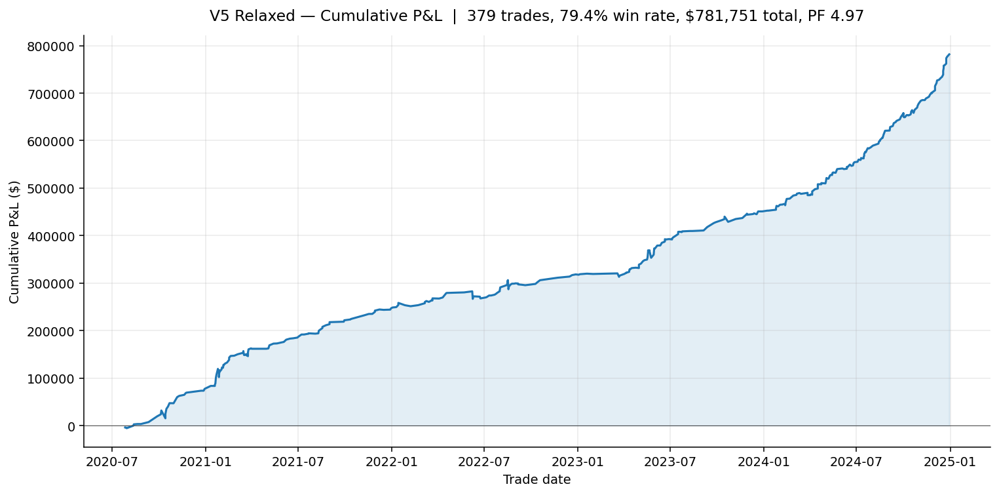
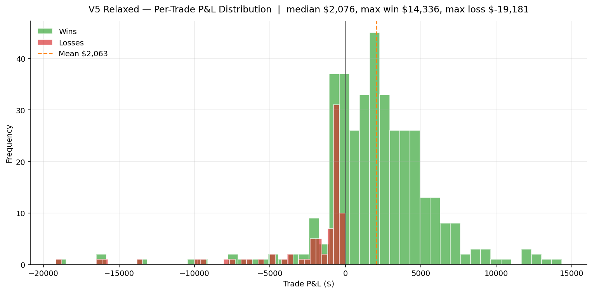
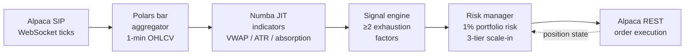
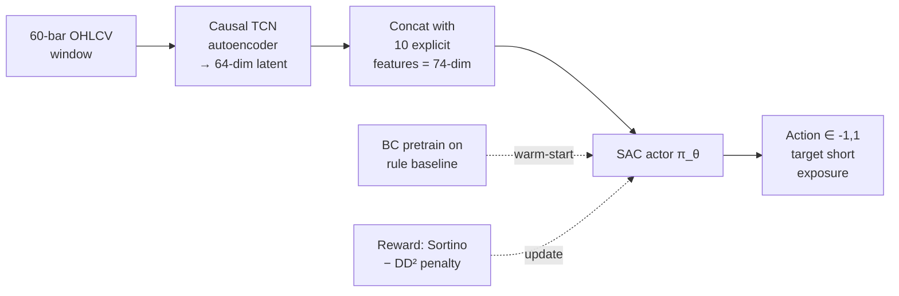

# Parabolic Reversal Trading Engine

[](https://www.python.org/)
[](LICENSE)
[](https://github.com/BColladoT/parabolic-reversal-trading-engine/actions/workflows/ci.yml)
[](https://github.com/BColladoT/parabolic-reversal-trading-engine/commits/main)
[](https://github.com/BColladoT/parabolic-reversal-trading-engine)

A Python-based intraday trading system that systematically short-sells micro-cap US equities exhibiting parabolic blow-off tops. Combines a production rules engine (validated in backtest) with a reinforcement learning position-sizing layer (in development).

> ### 🔗 This system has a dedicated analytics layer — also built by me
>
> The market data this engine produces is modeled into a **dbt + BigQuery** analytics pipeline —
> staging → intermediate → marts, with data-quality tests and a documented lineage graph:
> **[equities-dbt-bigquery →](https://github.com/BColladoT/equities-dbt-bigquery)**
>
> Two repos, one end-to-end system by the same author: this engine generates the data;
> that project turns it into tested, analysis-ready models.

## Thesis

Low-float micro-cap stocks gaining 60–500% intraday on retail momentum exhibit predictable mean-reversion to VWAP once volume exhausts. The system identifies these extensions, shorts them, and exits at defined targets — purely intraday, all positions flat by 15:25 ET.

## Results — Rules Engine (V5 Relaxed)

Backtest: 2020-07-27 → 2024-12-30, 719 micro-cap symbols, 1-minute bars.

| Metric | Value |
|---|---|
| Trades | 379 |
| Win rate | 79.4% |
| Total P&L | $781,750 |
| Profit factor | 3.89 |
| Sharpe (reported) | 2.34 |
| Sortino (reported) | 3.12 |





**Caveat:** these are whole-dataset, in-sample results. Parameters were tuned on the same data they're measured on. Walk-forward out-of-sample validation is the current next step.

Full technical report: [docs/V5_RELAXED_COMPREHENSIVE_REPORT.md](docs/V5_RELAXED_COMPREHENSIVE_REPORT.md).
Charts regenerated by: [scripts/generate_readme_charts.py](scripts/generate_readme_charts.py).

## Architecture

### Live trading data flow



### RL position-sizing layer (research)



### Rules engine (production)
- Multi-factor entry: VWAP extension >120%, volume <60% of session peak, momentum/volume divergence, absorption detection
- Progressive 3-tier scale-in (25 / 25 / 50%) with stricter volume thresholds per tier
- Layered exits: TP1 at VWAP, TP2 at –8%, TP3 at –15%, trailing stop after TP1
- Hard stop at parabolic apex + 2%, ATR volatility stop, 1% portfolio risk cap

### Reinforcement learning layer (research, in development)
- Soft Actor-Critic, continuous action ∈ [–1, 1] = target short exposure
- Causal Temporal Convolutional Net autoencoder for state representation (60 bars × 5 OHLCV → 64-dim latent)
- Observation: 64-dim latent + 10 explicit features = 74-dim
- Reward: Sortino with quadratic drawdown penalty
- Behavioral cloning pre-training on rules-engine decisions → SAC fine-tuning
- Walk-forward optimization with 10-day purge gap, two-phase per fold (critic warm-up → actor fine-tune)

**Current status:** RL pipeline executes end-to-end across 4 WFO folds, but trained policy has not yet outperformed the rule baseline (`test_reward_mean = 0`). Debugging the evaluation harness is the active focus.

## Tech stack

- **Language:** Python 3.9+
- **DataFrames:** Polars + PyArrow (chosen for streaming speedup over Pandas)
- **Numerics:** NumPy + Numba JIT for VWAP, ATR, absorption kernels (sub-ms per bar)
- **Broker / data:** alpaca-py + raw WebSockets for SIP tick feed
- **RL:** PyTorch + Ray RLlib (SAC), Gymnasium environment
- **Logging:** structlog + python-json-logger
- **Config:** YAML → nested dataclasses

## Methodological controls

- Causal TCN architecture guarantees no look-ahead in state representation
- `HybridDataProvider` enforces strict per-fold date isolation with runtime assertions
- Walk-forward optimization with purge gap prevents temporal leakage
- Hybrid data sampling (70% known winners + 30% all-volatility days) partially mitigates survivorship bias
- Tick-level backtester models 2-tick slippage and $0.005/share commission

## Project structure

```
quant_trading/
  config/                    # YAML configs (settings.yaml; secrets via .env)
  src/
    main_engine.py           # Live orchestrator
    data/                    # Alpaca client, Polars data engine
    indicators/              # Numba JIT kernels
    execution/               # Signal engine
    risk/                    # Position manager
    strategies/              # Strategy registry, V5 strict
    rl/                      # Env, SAC agent, TCN perception, hybrid data provider
    baselines/               # Rule baseline
    scripts/                 # WFO training, behavioral cloning, RL vs rule
    utils/                   # Config, metrics
  wfo_context/               # Self-contained snapshot for isolated RL runs
  tests/                     # Canonical test scripts
  scratch/                   # Exploratory / debug scripts (not production paths)
  docs/                      # Technical reports + archive of design notes
  run.py                     # Live trading entry point
  run_historical_backtest.py # Backtest entry point
  scan_extended_universe.py  # Universe scanner
```

## Quickstart

Run a simplified V5 Relaxed backtest on five sample setups in one command, no credentials needed:

```bash
pip install -r requirements.txt
python scripts/run_example_backtest.py
```

Output:

```
symbol date        entry      exit         gain%   vwap_x  shares        pnl  reason
-----------------------------------------------------------------------------------------------
BBIG   2021-08-27  14:24 ET   14:26 ET      62.0    1.311    1748    -199.97  hard_stop
GME    2021-01-22  12:39 ET   12:40 ET      61.2    1.251     147    -381.39  hard_stop
GME    2021-01-28  09:59 ET   10:00 ET      77.1    1.204      21    -196.39  hard_stop
KOSS   2021-01-27  10:55 ET   10:56 ET      70.6    1.538     339    -199.81  hard_stop
KOSS   2021-01-28  09:50 ET   09:59 ET      68.5    1.305      80   1,519.60  vwap_target
```

This is a stripped-down version of the strategy (single-tier entry, no scale-in, no ATR stop, no absorption detection). It shows the core entry signal — VWAP extension + volume exhaustion + time window — firing on real bars. The full production engine in `src/` adds scale-in, layered exits, and risk overlays; the headline 79.4% win rate above is from that engine, not this script.

Sample data lives in [`data/sample/`](data/sample/README.md) (~430 KB total, committed to the repo).

## Setup

Two environments because Ray/RLlib runs cleanest on Linux and the live engine targets Windows.

**Live engine + backtesting (Windows PowerShell):**

```powershell
python -m venv venv
venv\Scripts\activate
pip install -r requirements.txt

# Configure broker credentials
copy .env.template .env
# Edit .env with your Alpaca paper-trading API keys
```

**RL training (WSL / Linux — adds PyTorch + Ray RLlib + Gymnasium on top of base deps):**

```bash
python -m venv venv_wsl
source venv_wsl/bin/activate
pip install -r wfo_context/requirements.txt
export PYTHONPATH=/mnt/c/quant_trading/src:$PYTHONPATH
```

Python 3.9, 3.10, or 3.11 supported. The CI matrix runs against all three.

## Running

```bash
python run.py                                                    # Live paper trading
python run_historical_backtest.py --quick-test                   # Quick backtest (10 setups)
python run_historical_backtest.py --symbol AMC --date 2021-06-02 # Single setup
python scan_extended_universe.py                                 # Scan ~3,500 symbols
```

For RL training (in WSL):

```bash
export PYTHONPATH=/mnt/c/quant_trading/src:$PYTHONPATH
python src/scripts/behavioral_cloning.py    # BC pretrain
python src/scripts/train_wfo_quick_test.py  # 1-fold smoke test
python src/scripts/train_wfo.py             # Full WFO training
```

## Known limitations

- In-sample bias in headline rules-engine results; OOS validation not yet completed
- RL policy not yet outperforming rule baseline
- No live execution data — backtest assumes 2-tick slippage; real micro-cap shorts can cost more
- Short borrow / locate availability not modeled
- No formal pytest harness; tests are standalone scripts

## Roadmap

1. Diagnose RL zero-reward issue (verify rollout loads trained policy, inspect reward distributions)
2. Run V5 Relaxed through walk-forward for honest OOS Sharpe
3. Live paper trading at half size to measure real slippage vs backtest
4. Expand universe scanning to full ~3,500 symbols
5. Migrate tests to pytest, add CI

## Disclaimer

Research project. Not investment advice. Past backtest performance does not guarantee future results, especially in micro-cap shorts where borrow availability and slippage can be severe.
